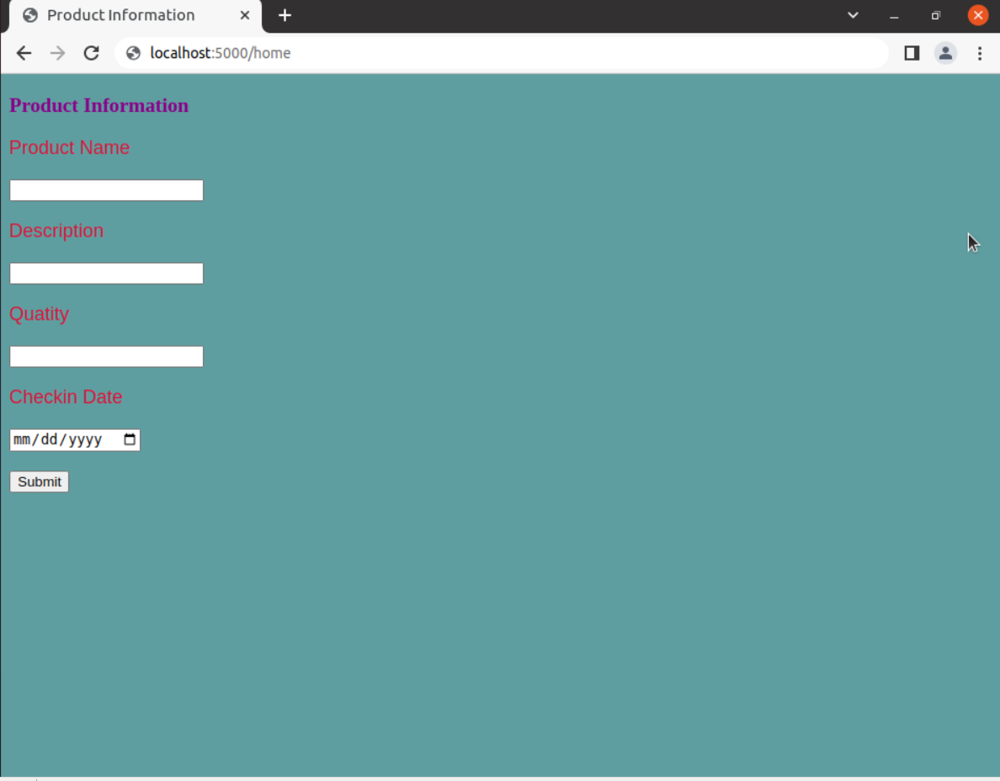
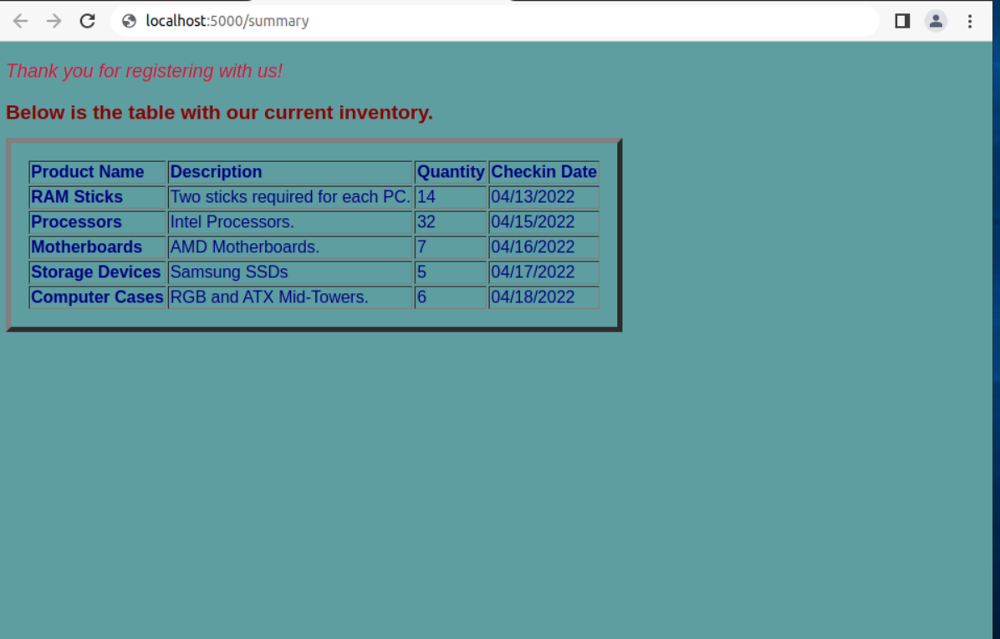

# SystemAnalysis-FinalProject

#This is Akshit Pathania's final project for the System Analysis and Design class. This project is a basic inventory management system for computer parts. It includes a #home page, a data entry page and a summary page where the current inventory is shown in tabular form. Python, HTML and basic CSS was used in this project.

#Some working images of the project are provided below:

#home.htm is the first page that pops up and it redirects you to the data entry page.

#The data entry page is where the user enter their product details and they are redirected to the summary page after they click submit.

#The summary page thanks the user for visiting the site. It also shows the different products entered in the dataentry page in tabular form.

#Here is the link to the working instance: https://us-west-1.console.aws.amazon.com/ec2/v2/home?region=us-west-1#InstanceDetails:instanceId=i-0f163a587f65b6b3c
# The ip address is 3.101.13.18 and it is on port 5000

