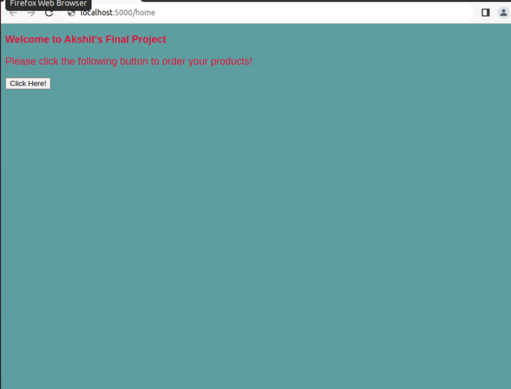

# SystemAnalysis-FinalProject

#This is Akshit Pathania's final project for the System Analysis and Design class. This project is a basic inventory management system for computer parts. It includes a #home page, a data entry page and a summary page where the current inventory is shown in tabular form. Python, HTML and basic CSS was used in this project.

#Some working images of the project are provided below:

#home.htm is the first page that pops up and it redirects you to the data entry page.

